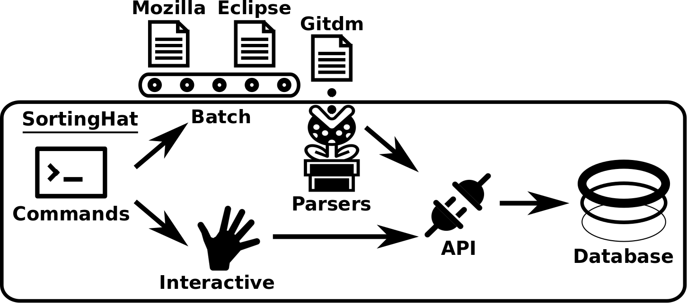
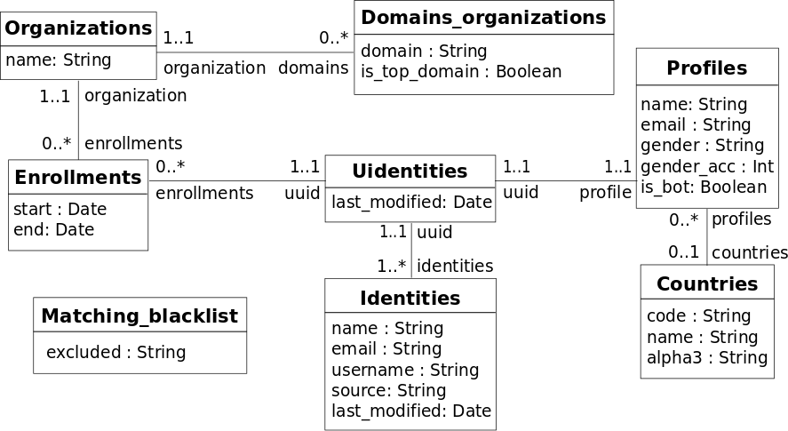
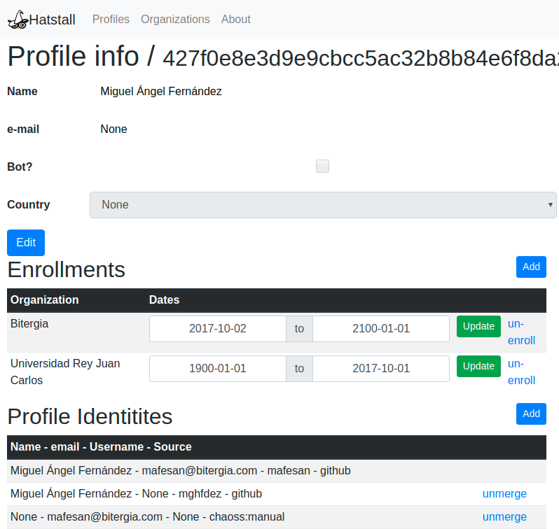

TODO

## SortingHat

SortingHat maintains a relational database with identities and related information extracted from different tools used
in software development (e.g., Git, GitHub, Slack). An identity is a tuple composed of a *name*, *email*, *username* and the name of the source
from where it was extracted. Tuples are converted to unique identifiers (i.e., *uuid*), which provide a quick mean to compare identities among each other. By default, SortingHat
considers all identities as unique ones. Heuristics take care to automatically merge identities based on perfect matches on (i) *uuids*, (ii) *name*, (iii) *email* or (iv) *username*. In case
of a positive match, an identity is randomly selected as the unique one, and the other identities are linked to it.

Identities can be interactively manipulated via shell commands, which hide low-level implementation details to the user, thus decoupling the shell from the database technology
in use. Then, each command is translated to one or more API calls in charge of dealing with the database specificities. Furthermore, identities can be loaded to SortingHat via batch
files written in specific formats, thus speeding up identities imports for projects with large communities. Batch files are processed by parsers and inserted to the underlying database
via API calls. Currently, the available parsers handle the following formats: *Gitdm*, *MailMap*, *Stackalytics* and the formats used for Eclipse and Mozilla committers.

The overall view of SortingHat’s approach is summarized in the figure below. It is composed of three components: Database, Commands and API.



*Overview of the approach underlying SortingHat*

### Database

SortingHat relies on open source technologies to store and manipulate identity information. It uses MySQL for storage
and SQLAlchemy to bridge database relations into objects. The conceptual schema of the SortingHat database is shown
in the figure below. 



*Overview of the SortingHat conceptual schema, where unique identities are the first-class citizens.*

At its heart, there are the unique identities (i.e., *Uidentities*) of project members. Every unique identity can have more than one *Identities*, which are found in the
software development tools of the project. They are described by the attributes name, email and username, plus the source where it was found (e.g., Git, GitHub) and the last date when
its attributes were modified or when it was (un)linked to a unique identity (i.e., last modified ). Furthermore, a unique identity has a *Profile* and a list of *Enrollments*. A profile
includes a summary of the project member such as *name*, *email*, whether it is a bot (i.e., *is_bot*), *gender*, and optionally the *Country* information (based on the ISO 3166 standard).

*Enrollments* express temporal relationships (i.e., start and end date attributes) between unique identities and *Organizations*. Thus, organizations and unique identities can have more
than one enrollments over time, but a given enrollment exists only for an organization and a unique identity. *Organizations* are defined by a name and can belong to different domains
(i.e., *Domains_organizations*). A domain represents affiliation relationships between organizations (i.e., *is_top_domain*). This is the case of large open source foundations like Linux
and Mozilla, where several organizations contribute to.

Finally, organization names or identities with specific email addresses, usernames or full names can be easily excluded from SortingHat by registering their values in a *Matching
blacklist*. The filter associated to the blacklist is executed every time an identity is inserted to the database or modified.

### Commands

SortingHat provides more than 20 [commands](https://github.com/chaoss/grimoirelab-sortinghat) to manipulate identities data. The list below summarizes the common ones,
which involve manual and heuristic-based operations.
- Manual operations
    - Add: add identities.
    - Show: show information about identities.
    - Profile: edit profile (e.g., update gender).
    - Remove: delete an identity.
    - Merge: merge unique identities.
    - Move: move an identity into a unique identity. It is worth noting that when the Move operation is executed over the same identity, it allows to unmerge the identity from its unique identity.
    - Orgs: list, add or delete organizations and domains.
    - Enroll: enroll identities into organizations.
    - Withdraw: unlink identities from organizations.
- Heuristic-based operations
    - Unify: merge identities using a matching algorithm.
    - Affiliate: enroll unique identities to organizations using email addresses and top/sub domains.
    - Autoprofile: auto complete profiles with emails and names found on the tools used in the project.
    - Autogender: auto complete gender information using the [genderize.io](https://genderize.io/) API.

### API

The shell commands are processed by the SortingHat API, which is based on a three-layer architecture that promotes
modularization and decoupling. The first layer consists of *basic methods* that interact with the database and implement
CRUD operations such as additions, deletions or searches (e.g., find organization). The second layer contains *composed
method*s, which leverage on the basic methods. This is the case of move identity, which retrieves two identities and
update their information. Finally, the top layer includes *complex methods* that have a one-to-one correspondence with
the shell commands. They rely on composed methods.

## SortingHat in action

This section describes how to install and use SortingHat, highlighting its main features.

### Installation

SortingHat has been developed in Python and tested mainly on GNU/Linux platforms. There are several ways for installing
SortingHat on your system (from pip, Docker or source code) which are detailed in the SortingHat repository.

### Use

Once installed, SortingHat can be used as a stand-alone program or a Python library

#### Stand alone program

Using SortingHat as stand-alone program requires only some basic knowledge of GNU/Linux shell commands. The listing below shows how easy it is to add, list
and merge identities. As can be seen, the command add accepts name, email, username and data source (e.g., git) of
the identity to be inserted. The command show prints profile data and the list of identities linked to the unique identifier
passed as input. Finally, the command merge allows to perform a manual merge on two identities using as input their
unique identifiers, while the command unify automatically merges unique identities on a set of optional data sources
using heuristics (e.g., perfect matches on usernames).

```bash
# Adding identities
$ sortinghat add -- name " Harry Potter " -- email " hpotter@hogwarts . edu " -- source git
New identity 0 ca .. c1 added

$ sortinghat add -- name " Harry Potter " -- username " harryp " -- source github
New identity 11 c .. ab added

$ sortinghat add -- name " H . Potter " -- username " harryp " -- source slack
New identity 23 d .. r2 added

# Listing identities
$ sortinghat show 0 ca .. c1
unique identity 0 ca .. c1
Profile : ...
Identities :
0 ca .. c1 Harry Potter hpotter@hogwarts . edu - git

# Merge identities
$ sortinghat merge 0 ca .. c1 11 c .. ab
Unique identity 0 ca .. c1 merged on 11 c .. ab

# Unify identities
$ sortinghat unify -- sources github slack -- matcher username
Total unique identities processed 2
```

#### Python library

Including SortingHat functionalities to Python scripts and applications is easy, since the user only needs some basic knowledge of Python. Currently,
SortingHat is integrated in ELK. The listing below shows how information related to identities is uploaded to SortingHat via ELK. The method
add identity uses the SortingHat API calls to add identities, organizations, enrollments.

```python
from sortinghat import api

def add_identity (cls, db, identity, backend):

    uuid = api.add_identity (db, backend, identity['email'], identity['name'], identity['username'])
    profile = {
        "name" : "..", 
        "email" : identity['email']
    }

    api.add_organization(db, identity['company'])
    api.add_enrollment(db, uuid, identity['company'], ...)

    return uuid
```

## Example
TODO

## HatStall

SortingHat functionalities are also available via HatStall, a Web application written in Django, a popular framework for Web development in Python. HatStall
provides an intuitive graphical interface to perform operations over a SortingHat database. It is fully open source, available as a [Docker image](https://hub.docker.com/r/grimoirelab/hatstall/), and 
can be easily plugged to GrimoireLab. After starting HatStall, the user sets up the parameters (e.g., username, host) to connect to an existing
SortingHat database, and then navigates and modifies the identities data through the application. The figure below shows the information of a CHAOSS project member. The page contains his profile data, enrollments and identities plus widgets
to modify them.



*CHAOSS member data shown through HatStall, it includes his profile, enrollments and identities.*